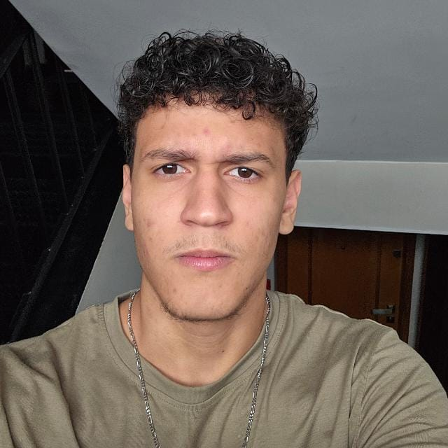
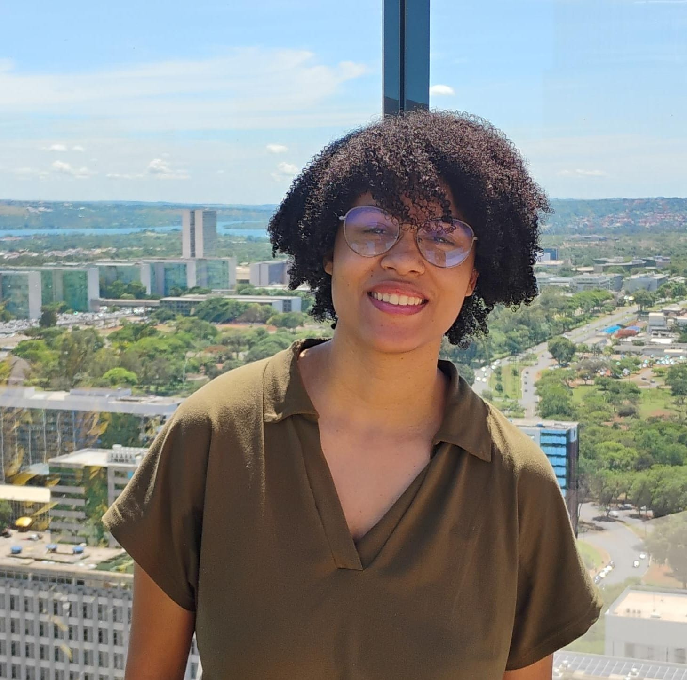

# A Equipe

Conheça os membros responsáveis por este projeto da disciplina de Interação Humano-Computador.

---

{ .team-avatar }

[Heitor Macêdo Ricardo](https://github.com/HeitorM50/){: target="_blank" }

*Estudante de Engenharia de Software focado em resolver problemas reais enquanto desenvolve habilidades em organização, desenvolvimento e integração de sistemas.*

{ .team-avatar }

[Pedro Augusto Moretti Moreira](https://github.com/morettipdr/){: target="_blank" }

    

*Estudante de Engenharia de Software na UnB e Desenvolvedor Full-stack com domínio em React e Quarkus. Com sólida experiência em definições arquiteturais, busco transformar problemas complexos em soluções escaláveis, eficientes e de alto impacto.*

{ .team-avatar }

[Heloisa Laura Santos da Silva](https://github.com/Heloisa-Santos){: target="_blank" }

*Estudante de Engenharia de Software na UnB, com experiência em frameworks como Angular, Spring e Quarkus. Possui domínio em Ciência de Dados e Machine Learning, direcionando seus estudos e projetos para análise de dados e desenvolvimento de soluções inteligentes.*

{ .team-avatar }

[Pedro Augusto Macedo](#)

*A mini-bio detalhada do integrante será escrita aqui explicando suas melhores qualificações para o projeto.*

{ .team-avatar }

[Eduardo Valadares](#)

*A mini-bio detalhada do integrante será escrita aqui explicando suas melhores qualificações para o projeto.*

