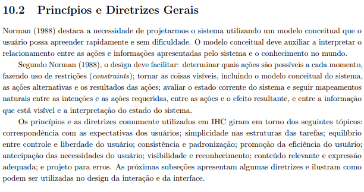

# Princípios Gerais do Projeto

## 1. Introdução
Os princípios e diretrizes de design de Interação Humano-Computador (IHC) são regras gerais de alto nível que auxiliam a equipe a conceber um sistema com alta qualidade de uso. Segundo Barbosa e Silva (2021), a aplicação adequada de boa parte dos princípios depende do conhecimento do designer acerca do domínio do problema, dos usuários e das suas atividades, servindo como uma ferramenta prática de apoio à criatividade e à tomada de decisão durante o processo de design. 

Abaixo, detalhamos os princípios gerais que guiarão o projeto de redesign do sistema do PROCON-DF, baseados na literatura consolidada da área.

---

## 2. Princípios Adotados no PROCON-DF

### 2.1 Correspondência com as expectativas dos usuários
*   **O que é:** O sistema deve falar a linguagem do usuário, com palavras, frases e conceitos familiares a ele, em vez de termos orientados ao sistema.
*   **Aplicação no projeto:** O sistema do PROCON-DF evitará jargões jurídicos (como "polo passivo" ou "jurisprudência"), utilizando uma "Linguagem Cidadã" com termos simples e focados em problemas cotidianos (ex: "atraso na entrega", "produto com defeito"). Isso se alinha às dificuldades de vocabulário evidenciadas pelos usuários. *(Baseado no Grupo de Foco e Análise Documental, que apontaram a barreira do "juridiquês" - perfil do Consumidor).*

### 2.2 Simplicidade nas estruturas das tarefas
*   **O que é:** Reduzir a complexidade do que o usuário precisa fazer, simplificando o planejamento e a execução das tarefas.
*   **Aplicação no projeto:** O fluxo de registrar uma reclamação será transformado em um assistente guiado passo a passo (Wizard), sem formulários densos em uma única tela. Isso reduz a carga cognitiva, fornecendo uma trilha intuitiva. *(Baseado no Grupo de Foco e Entrevista, onde os usuários relataram a desorganização visual e frustração com os formulários do site atual - Personas Ivone e Laura).*

### 2.3 Equilíbrio entre controle e liberdade do usuário
*   **O que é:** Os usuários frequentemente escolhem funções do sistema por engano e precisarão de uma "saída de emergência" claramente marcada para sair do estado indesejado.
*   **Aplicação no projeto:** Na sala de conciliação virtual e no portal de acompanhamento, o usuário terá opções claras para silenciar microfone, pedir "momento privado" e anexar ou responder documentos a qualquer instante. *(Baseado na proposição das funcionalidades de Sala Virtual e Portal de Acompanhamento, que visam devolver o controle ao usuário e ao fornecedor sobre sua participação).*

### 2.4 Consistência e padronização
*   **O que é:** Os usuários não devem ter que se perguntar se palavras, situações ou ações diferentes significam a mesma coisa.
*   **Aplicação no projeto:** A interface seguirá padrões de Clean Design mantendo uma identidade visual unificada (cores, tipografia, chamadas de ação/CTA de alto contraste), evitando a ruptura técnica e visual que ocorre ao redirecionar usuários para subsistemas diferentes. *(Baseado na Análise Documental e Perfil de Usuário da Antipersona "Seu José", que relata confusão e sensação de "spam" na despadronização do sistema atual).*

### 2.5 Promoção da eficiência do usuário
*   **O que é:** O sistema deve oferecer atalhos e aceleradores para usuários experientes, permitindo que a interação seja mais rápida.
*   **Aplicação no projeto:** O projeto incorporará a validação automática de documentos via OCR e a integração de login com o Gov.br. Isso elimina a necessidade de digitação e validação manual intensa, poupando tempo para consumidores que desejam registrar demandas rápidas. *(Baseado na Entrevista com Fornecedores e Análise Documental - Personas Gustavo e Lucas, que necessitam de interações pragmáticas e aceleradas).*

### 2.6 Antecipação das necessidades do usuário
*   **O que é:** O sistema deve prever o que o usuário quer e precisa, em vez de esperar que ele busque ou invoque as ferramentas.
*   **Aplicação no projeto:** Implementação de alertas inteligentes de contagem regressiva e notificações proativas (e-mail/SMS) informando sobre mudanças no status do processo e encerramento de prazos de prescrição, e sugerindo encaminhamento à Justiça (Juizado Especial) em caso de falha administrativa. *(Baseado na Entrevista com Consumidores - Persona Roberto, que necessita de monitoramento de prazos automático sem busca manual).*

### 2.7 Visibilidade e reconhecimento
*   **O que é:** Deixar visíveis as opções e ações, minimizando a carga de memória do usuário. Reconhecer é mais fácil do que lembrar.
*   **Aplicação no projeto:** Um painel autenticado apresentará uma linha do tempo visual, mostrando cada etapa da reclamação, o que aconteceu, o que está pendente, responsável e o próximo passo, além do relógio de acompanhamento de prazos. *(Baseado no Grupo de Foco, que apontou a falta de retorno e frustração ao visualizar status estáticos no sistema atual).*

### 2.8 Conteúdo relevante e expressão adequada
*   **O que é:** Os diálogos não devem conter informações irrelevantes ou raramente necessárias.
*   **Aplicação no projeto:** Limpeza da página inicial utilizando *Clean Design* e dividindo claramente o "Portal do Lojista" da área do consumidor. Notícias e cartilhas longas serão removidas da via de acesso a reclamações, apresentando apenas o botão central destacado de "Iniciar Reclamação". *(Baseado no Grupo de Foco e Entrevista de Fornecedores, revelando poluição visual, ruído excessivo de informações inúteis para empresários e aparência de "spam" - Personas Ivone e Gustavo).*

### 2.9 Projeto para erros
*   **O que é:** Ajudar os usuários a reconhecerem, diagnosticarem e se recuperarem de erros por meio de mensagens claras.
*   **Aplicação no projeto:** Utilização da verificação inicial com a ferramenta OCR para anexos, apontando em tempo real com orientações rápidas quando um arquivo se encontra ilegível ou incorreto. Na sala de conciliação virtual, verificação prévia obrigatória de áudio e vídeo antes do início das reuniões. *(Baseado na Análise Documental, que identificou alto retrabalho decorrente de entregas incorretas, gerando desgaste - Persona Maria Helena).*

---

## 3. Comprovação e Referência Bibliográfica
Conforme exigência do **Item 11 e 12** da verificação da Etapa 3, abaixo consta a referência teórica que fundamenta os princípios gerais de projeto adotados.

## Agradecimentos à IA

Agradecimento ao **ChatGpt** pela ajuda na estruturação deste documento.

**Referência:** 
> BARBOSA, Simone D. J.; SILVA, Bruno S. da; SILVEIRA, Milene S.; GASPARINI, Isabela; DARIN, Ticianne; BARBOSA, Gabriel D. J. *Interação Humano-Computador e Experiência do Usuário*. 1. ed. Rio de Janeiro: Autopublicação, 2021. (Capítulo 10: Princípios e Diretrizes para o Design de IHC, Seção 10.2).

### Figura 1 – Início da Seção 10.2: Princípios e Diretrizes Gerais

**Fonte:** BARBOSA et al. (2021, p. 252).

---

## Histórico de Versão
| Versão | Data | Descrição | Autor(es) | Revisor(es) |
| :--- | :--- | :--- | :--- | :--- |
| 1.1 | 10/05/2026 | Adição das imagens na referencia e agradecimento a IA | Pedro Macedo | Heitor Macedo Ricardo |
| 1.0 | 10/05/2026 | Criação dos Princípios Gerais de Projeto. | Heitor Macedo Ricardo | Pedro Macedo |
