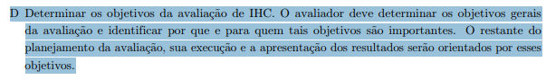
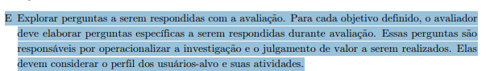
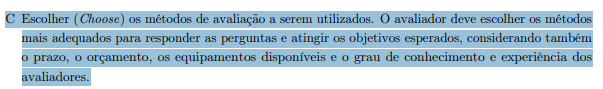
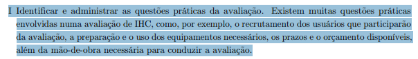
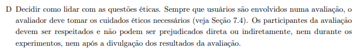
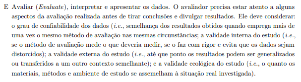

# Planejamento da Avaliação do Storyboard

## Colaboração
Colaboração referente a [Etapa 4](../../planejamento/cronograma-executado.md)

| Autores | Contribuiu |
|---|---|
| Pedro Moretti | Elaborou o Artefato  |
| Eduardo | Elaborou o Artefato  |

Este documento detalha o planejamento para a avaliação dos storyboards elaborados para o projeto, utilizando o framework **DECIDE** proposto por Preece et al. (2002) e adaptado por Barbosa e Silva (2021)<a href="#ref1">[1]</a>.

## Introdução

A avaliação de storyboards é essencial para identificar **problemas na interação e na interface** representados nas alternativas de design e para avaliar a **apropriação da tecnologia pelos usuários** diante da solução proposta. Este processo permite identificar pontos fracos na proposta de design antes do investimento em protótipos mais complexos, garantindo que a direção do projeto esteja alinhada com as necessidades e expectativas do público-alvo.

---

## Metodologia

Este planejamento de avaliação segue o **framework DECIDE**, uma abordagem sistemática proposta por Preece et al. (2002) e adaptada por Barbosa e Silva (2021)<a href="#ref1">[1]</a> para estruturar avaliações em Interação Humano-Computador (IHC).

O DECIDE funciona como um roteiro que orienta o avaliador através de seis etapas sequenciais, garantindo que todos os aspectos críticos sejam considerados. Cada letra representa uma fase do processo:

- **D** – **Determinar** os objetivos gerais da avaliação e identificar por que se está avaliando
- **E** – **Explorar** perguntas específicas que a avaliação deve responder
- **C** – **Escolher** os métodos de avaliação mais apropriados
- **I** – **Identificar** e administrar as questões práticas (recrutamento, cronograma, recursos)
- **D** – **Decidir** como lidar com questões éticas e de segurança dos participantes
- **E** – **Avaliar** (Evaluate) os dados coletados e relatar os resultados

---

## 1. D - Determinar os objetivos da avaliação <a href="#fig-d">[2]</a>

Com base nos tipos de avaliação descritos por Barbosa et al. (2021, Capítulo 11), esta avaliação está orientada a dois aspectos complementares: **avaliar problemas na interação e na interface** representados nos storyboards e **avaliar a apropriação da tecnologia pelos usuários** diante da solução proposta.

### Avaliar Problemas na Interação e na Interface

A avaliação de problemas na interação e na interface busca identificar, nos storyboards, elementos que possam prejudicar a qualidade de uso do sistema proposto (Barbosa et al., 2021, p. 249). Os problemas identificados serão classificados de acordo com sua gravidade e com os fatores de qualidade de uso prejudicados — usabilidade, experiência do usuário, acessibilidade ou comunicabilidade.

**Objetivos específicos para este aspecto:**

* Identificar problemas na narrativa visual do storyboard que possam gerar confusão ou ambiguidade sobre o funcionamento do sistema.
* Verificar se a sequência de ações representada comunica claramente as intenções de uso do sistema (comunicabilidade).
* Avaliar se o fluxo proposto apresenta inconsistências ou lacunas que prejudiquem a usabilidade e a experiência do usuário.
* Classificar os problemas encontrados quanto à gravidade potencial caso fossem implementados no sistema final.

### Avaliar a Apropriação da Tecnologia pelos Usuários

A avaliação da apropriação de tecnologia busca compreender se a solução proposta atende às necessidades dos usuários e se estes a incorporariam em seu cotidiano (Barbosa et al., 2021, p. 248-249).

**Objetivos específicos para este aspecto:**

* Compreender se o cenário retratado no storyboard reflete o contexto real de uso e as necessidades dos usuários do PROCON-DF.
* Investigar se os participantes se identificam com a situação apresentada e se utilizariam o sistema proposto em seu dia a dia.
* Verificar se a solução ilustrada oferece apoio computacional adequado para resolver o problema do usuário.
* Avaliar a percepção de satisfação e agradabilidade dos participantes em relação à solução proposta.
* Identificar possíveis barreiras que levariam os usuários a não adotar o sistema representado.

> **Exemplo Prático:** Se o storyboard retrata um consumidor registrando uma reclamação no site do PROCON-DF, a avaliação investigará tanto problemas de interação (ex.: a sequência de passos é confusa? Faltam elementos de feedback?) quanto a apropriação da tecnologia (ex.: o usuário se sentiria confortável usando esse sistema? Ele acredita que o sistema reduziria o tempo para registrar uma reclamação?).

---

## 2. E - Explorar perguntas a serem respondidas <a href="#fig-e">[3]</a>

Para tornar os objetivos operacionais, a equipe elaborou perguntas específicas organizadas pelos dois aspectos avaliados (Barbosa et al., 2021, p. 249-250).

### Perguntas sobre Problemas na Interação e na Interface

Com base em Barbosa et al. (2021, p. 250-251), as seguintes perguntas nortearão a avaliação deste aspecto:

1. Considerando cada perfil de usuário esperado: o usuário consegue operar o sistema?
2. Ele atinge seu objetivo? Com quanta eficiência? Em quanto tempo? Após cometer quantos erros?
3. Que parte da interface e da interação o deixa insatisfeito?
4. Ele entende o que significa e para que serve cada elemento de interface? Ele vai entender o que deve fazer em seguida?
5. Que problemas de IHC dificultam ou impedem o usuário de alcançar seus objetivos? Onde esses problemas se manifestam? Com que frequência tendem a ocorrer? Qual é a gravidade desses problemas?
6. Quais barreiras o usuário encontra para atingir seus objetivos?

### Perguntas sobre Apropriação da Tecnologia pelos Usuários

Com base em Barbosa et al. (2021, p. 250), as seguintes perguntas nortearão a avaliação deste aspecto:

7. De que maneira os usuários utilizam o sistema? Em que difere do planejado?
8. Que variação houve no número de erros cometidos pelos usuários ao utilizarem o novo sistema? E no tempo que levam para atingir seus objetivos? E na sua satisfação com o sistema?
9. O quanto os usuários consideram o apoio computacional adequado para auxiliá-los na realização de suas atividades?
10. O quanto eles são motivados a explorar novas funcionalidades?
11. Quais são os pontos fortes e fracos do sistema, na opinião dos usuários?
12. Quais objetivos dos usuários podem ser alcançados através do sistema? E quais não podem? Quais necessidades e desejos foram ou não atendidos?
13. Por que os usuários não incorporaram o sistema no seu cotidiano?

---

## 3. C - Escolher (Choose) os métodos de avaliação <a href="#fig-c">[4]</a>

Como os storyboards são artefatos estáticos e narrativos de baixa fidelidade, métodos baseados em interação direta com software (como testes de usabilidade em software rodando) não são aplicáveis.

**Método Selecionado:** Investigação através de **Entrevistas Semiestruturadas com uso de Storyboards**.

**Justificativa:** 
A entrevista permite apresentar a narrativa visual ao usuário e investigar profundamente suas opiniões e reações sobre a solução proposta. O formato semiestruturado garante que as perguntas sobre problemas na interação e na interface e sobre apropriação da tecnologia sejam abordadas, mas dá ao avaliador a liberdade de fazer perguntas adicionais (ex: *"Por que você achou essa ação estranha?"*, *"Você acha que essa sequência de ações faria sentido no seu dia a dia?"*) sempre que o usuário apresentar um comportamento ou comentário inesperado, aprofundando a coleta de dados em ambos os aspectos avaliados.

---

## 4. I - Identificar e administrar as questões práticas <a href="#fig-i">[5]</a>

Para garantir a viabilidade e o rigor metodológico da avaliação dos storyboards do site do Procon-DF, a equipe deverá gerenciar os seguintes aspectos organizacionais:

**Recrutamento de Participantes:** Cada autor dos storyboards será responsável por recrutar um usuário compatível com o perfil definido nas personas e cenários do projeto. Cada integrante da equipe conduzirá uma avaliação individual com seu respectivo usuário.

**Preparação da Avaliação:** Cada sessão contará com um Entrevistador, responsável por guiar a conversa e apresentar os storyboards, e um Observador/Anotador, encarregado de registrar comportamentos, hesitações e gerenciar a gravação. A avaliação ocorrerá de forma presencial, em ambiente silencioso e sem interrupções.

**Materiais Necessários:** Preparação dos arquivos digitais dos storyboards, Termo de Consentimento Livre e Esclarecido (TCLE), roteiro de perguntas padronizado e formulário de anotações.

**Recursos e Custos:** A avaliação foi planejada para ter custo zero, utilizando celular para gravação de áudio e vídeo da sessão. Os storyboards serão apresentados aos participantes em formato digital, exibidos em computador, celular, tablet ou outro dispositivo.

**Cronograma:** As entrevistas serão agendadas conforme a disponibilidade dos participantes, seguindo o cronograma macro do projeto. Os resultados de cada sessão devem ser documentados imediatamente após a ocorrência.

| Storyboard | Entrevistador(es) | Entrevistados | Horário de Início | Horário de Fim | Data |
| :---: | :---: | :---: | :---: | :---: | :---: |
| [Nome do Storyboard] | [Nome] | [ID do Participante] | [Hora] | [Hora] | [Data] |

**Roteiro de Perguntas (Abordagem Semiestruturada):** O roteiro será construído sob a ótica de uma entrevista semiestruturada, que busca um equilíbrio entre o rigor do planejamento e a flexibilidade da conversa. O roteiro não será apenas uma lista de perguntas fechadas, mas um guia composto por tópicos e perguntas abertas dispostos em uma ordem lógica. Essa estrutura permite que o avaliador tenha liberdade para explorar em maior profundidade as respostas do participante e até modificar a ordem dos assuntos se a conversa fluir naturalmente para outro ponto, desde que mantenha o foco nos objetivos da avaliação.

Para manter o tom natural, o roteiro poderá conter "lembretes" de tópicos em vez de frases literais, evitando que o entrevistador quebre o ritmo da conversa ao ler as perguntas.

**Perguntas de Exemplo para o Storyboard:**

*   **Opinião Geral:** O que você achou dessa história apresentada? Ela faz sentido no contexto do Procon?
*   **Verossimilhança:** Você consegue se imaginar realizando essas ações ou passando por essa situação na vida real?
*   **Completude:** Na sua visão, falta algum passo importante para que o personagem complete a tarefa?
*   **Clareza Visual:** Algum elemento do desenho (personagem, cenário ou objeto) gerou confusão?

**Execução do Roteiro:** A entrevista será desenvolvida seguindo uma estrutura narrativa específica recomendada pela literatura para garantir o conforto do participante e a qualidade dos dados:

*   **Apresentação:** O avaliador apresenta-se, explica os objetivos da pesquisa sobre o site do Procon e garante o sigilo dos dados.
*   **Aquecimento:** São feitas perguntas de fácil resposta (dados demográficos e experiência com internet) para deixar o usuário à vontade.
*   **Exploração do Storyboard (Parte Principal):** O entrevistador guia o usuário pela narrativa visual. Como a entrevista é semiestruturada, o avaliador deve ouvir atentamente e fazer perguntas de acompanhamento (follow-up) para se aprofundar em pontos inesperados ou opiniões críticas que o usuário manifeste espontaneamente.
*   **Desaquecimento:** Momento para o participante expressar comentários finais e o avaliador desfazer qualquer tensão que tenha surgido durante as críticas ao storyboard.
*   **Encerramento:** O avaliador agradece a participação, desliga a gravação e informa como o usuário pode entrar em contato com a equipe.

**Atenção na Condução:** O entrevistador deve evitar formular perguntas que induzam o usuário a concordar com o storyboard. Em vez de perguntar "Você gostou de como o personagem fez a reclamação?", deve-se perguntar "O que você acha da forma como o personagem agiu?". Toda alteração sugerida deve ser anotada para análise posterior da equipe.

---

## 5. D - Decidir como lidar com as questões éticas <a href="#fig-d2">[6]</a>

A avaliação envolve a participação de pessoas, logo, os princípios éticos de pesquisa científica devem ser respeitados incondicionalmente, visando proteger os dados e o bem-estar dos usuários.

*   **Termo de Consentimento (TCLE):** O avaliador deverá apresentar o TCLE e solicitar o consentimento (gravado em vídeo ou assinado) **antes** de iniciar as perguntas. O documento deve explicar o objetivo da pesquisa, garantir que os dados serão usados apenas para fins acadêmicos e informar o tempo estimado da entrevista.
*   **Direito de Retirada:** Ficará explícito para o participante que ele pode desistir da entrevista a qualquer momento, sem precisar justificar e sem sofrer qualquer prejuízo.
*   **Privacidade e Anonimato:** Nenhuma informação pessoal sensível ou nome completo dos participantes será divulgado no relatório da disciplina. Serão utilizados identificadores como "Participante 1 (P1)". Imagens de rosto serão borradas ou ocultadas nos relatórios, a menos que autorizado explicitamente.
*   **Foco no Artefato, Não no Indivíduo:** O avaliador deve tranquilizar o usuário no início da sessão, dizendo: *"Nós estamos avaliando o nosso desenho e as nossas ideias, não estamos avaliando você. Não existem respostas certas ou erradas, toda a sua sinceridade nos ajuda a melhorar o projeto."*

---

## 6. E - Avaliar (Evaluate), interpretar e apresentar os dados <a href="#fig-e2">[7]</a>

O processo de avaliação não termina quando a entrevista acaba. Para que o trabalho tenha validade, os dados coletados precisam ser tratados e consolidados da seguinte maneira:

1.  **Transcrição e Compilação Bruta:** O observador deve assistir às gravações e transformar os relatos verbais em texto, extraindo citações marcantes, dificuldades e sugestões propostas pelos participantes.
2.  **Análise e Categorização:** A equipe se reunirá para ler os dados compilados e categorizá-los de acordo com os dois aspectos avaliados:
    - **Problemas na interação e na interface:** agrupar por tipo de problema (ambiguidade na narrativa, lacunas no fluxo, problemas de comunicabilidade), gravidade potencial e fator de qualidade prejudicado.
    - **Apropriação da tecnologia:** agrupar por percepções de relevância do cenário, identificação com o personagem, satisfação com a solução e intenção de uso.
3.  **Identificação de Problemas e Sugestões:** A partir dos padrões identificados, a equipe extrairá a lista final de problemas do design proposto, classificados por gravidade e fator de qualidade de uso prejudicado.
4.  **Relato dos Resultados:** Por fim, a equipe produzirá um documento contendo:
    *   **O planejamento e execução:** (Onde ocorreu, quem participou, perfil dos usuários reais).
    *   **Feedback Positivo:** O que os usuários gostaram e validaram na proposta.
    *   **Tabela de Problemas e Melhorias:** Uma tabela contendo o problema encontrado, sua classificação de gravidade, o fator de qualidade prejudicado (usabilidade, experiência do usuário, acessibilidade ou comunicabilidade), a justificativa (baseada na fala do usuário) e a proposta de reprojeto/melhoria sugerida pela equipe.

---

## 7. Teste Piloto

Antes de avaliar com o público externo, a equipe deve conduzir um teste piloto com um colega. O objetivo é verificar se o roteiro dura o tempo planejado (estimado entre 15 e 20 minutos), se a câmera/gravação está funcionando corretamente e se as perguntas do roteiro semiestruturado estão claras e compreensíveis para o participante. 

Embora as respostas e opiniões coletadas durante o piloto devam ser descartadas (não integrando a análise qualitativa final dos resultados), a **execução do teste piloto deve ser registrada no documento de relato final**. Os avaliadores devem relatar a data, o horário, a duração, o participante piloto e, principalmente, quaisquer problemas ou dificuldades de comunicação identificados que levaram ao refinamento do roteiro e do protocolo antes das sessões oficiais.

---
## Agradecimentos à IA

Agradecimento ao **Gemini** pela ajuda na estruturação deste documento ao montar o padrão de seções e formatação de texto.

## Referências 

> [1] BARBOSA, Simone D. J.; SILVA, Bruno S. da; SILVEIRA, Milene S.; GASPARINI, Isabela; DARIN, Ticianne; BARBOSA, Gabriel D. J. **Interação Humano-Computador e Experiência do Usuário**. 1. ed. Rio de Janeiro: Autopublicação, 2021. (Capítulo 6, Seção 6.3.4, p. 107-108).

## Histórico de Versão

| Versão | Data | Descrição | Autor | Revisor |
| :---: | :---: | :---: | :---: | :---: |
| 1.3 | 29/05/2026 | Atualização dos objetivos e perguntas com base no livro; ajustes nos recursos e cronograma | Pedro Moretti | Heitor Macedo |
| 1.2 | 22/05/2026 | Correção e alinhamento do teste piloto com o planejamento de relato | Eduardo Valadares e Pedro Moretti | Heitor Macedo |
| 1.1 | 19/05/2026 | Adição da introdução, metodologia DECIDE, tabela de cronograma e detalhamento do roteiro de perguntas e execução | Eduardo Valadares | Heitor Macedo |
| 1.0 | 19/05/2026 | Criação do planejamento de avaliação do storyboard | Pedro Moretti | Heitor Macedo |

---

---

## Notas de Rodapé e Referências de Imagens

**Figura 1** - D: Determinar os objetivos da avaliação.

Fonte: BARBOSA et al. (2021, p. 264).<a href="#ref1">[1]</a>

**Figura 2** - E: Explorar perguntas a serem respondidas.

Fonte: BARBOSA et al. (2021, p. 264).<a href="#ref1">[1]</a>

**Figura 3** - C: Escolher os métodos de avaliação.

Fonte: BARBOSA et al. (2021, p. 264).<a href="#ref1">[1]</a>

**Figura 4** - I: Identificar e administrar as questões práticas.

Fonte: BARBOSA et al. (2021, p. 264).<a href="#ref1">[1]</a>

**Figura 5** - D: Decidir como lidar com as questões éticas.

Fonte: BARBOSA et al. (2021, p. 264).<a href="#ref1">[1]</a>

**Figura 6** - E: Avaliar (Evaluate), interpretar e apresentar os dados.

Fonte: BARBOSA et al. (2021, p. 264).<a href="#ref1">[1]</a>
