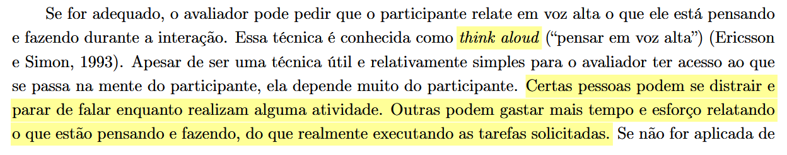

# Relato dos Resultados da Avaliação do Protótipo de Papel — Painel de Monitoramento de Prazos com Alertas Jurídicos

## Colaboração
Colaboração referente a [Etapa 5](../../planejamento/cronograma-executado.md)

| Autores | Contribuiu |
|---|---|
| [Mateus Barreto](../../equipe/equipe.md) | Elaborou o Artefato |

## Introdução

Este artefato documenta os resultados obtidos durante a avaliação do protótipo de papel elaborado para a funcionalidade de **Painel de Monitoramento de Prazos com Alertas Jurídicos** do projeto PROCON-DF. O objetivo da avaliação foi identificar problemas de usabilidade na interação e na interface representados no protótipo de papel, bem como verificar a conformidade do design com padrões de usabilidade reconhecidos. A avaliação foi planejada e conduzida conforme descrito no [Planejamento da Avaliação do Protótipo de Papel](./planejamento-avaliacao-pp.md) e os resultados são relatados segundo a estrutura definida no [Planejamento do Relato dos Resultados do Protótipo de Papel](./planejamento-relato-resultados-pp.md).

---

## 1. Objetivos e escopo da avaliação

A avaliação do protótipo de papel teve como objetivos centrais:

* **Verificar a conformidade com um padrão** — avaliar se a organização visual e a arquitetura de informação do protótipo seguem padrões de usabilidade reconhecidos, e se a interface proposta é consistente e previsível para o usuário do PROCON-DF;
* **Identificar problemas na interação e na interface** — identificar obstáculos, erros e dificuldades encontradas pelo usuário ao interagir com as telas do protótipo de papel, verificando se o fluxo de navegação proposto permite que o usuário realize suas tarefas com eficiência e sem ambiguidade.

Especificamente, buscou-se responder às seguintes perguntas de pesquisa:

1. Com o protótipo de papel foi possível explorar conceitos de design?
2. Foi observada alguma sugestão de melhoria para o protótipo proposto?
3. A interface proposta está em conformidade com padrões de usabilidade reconhecidos?
4. Foi possível identificar problemas de usabilidade preliminares?
5. O usuário consegue operar o sistema representado no protótipo? Ele atinge seu objetivo? Com quanta eficiência?
6. Que parte da interface ou do fluxo de interação o deixa insatisfeito ou confuso?
7. O usuário entende o que significa e para que serve cada elemento de interface?
8. Quais barreiras o usuário encontra para atingir seus objetivos nas tarefas propostas?

---

## 2. Método de avaliação empregado

O método utilizado foi a **Observação e Entrevista Semiestruturada com uso do Protótipo de Papel**, conforme definido no [Planejamento da Avaliação do Protótipo de Papel](./planejamento-avaliacao-pp.md). O avaliador apresentou as telas do protótipo impressas em papel, uma a uma, simulando a interação do usuário com o sistema. Os participantes apontavam com o dedo onde clicaria e verbalizavam suas ações e pensamentos em voz alta (protocolo *Think Aloud*). A sessão foi conduzida seguindo a estrutura narrativa planejada: apresentação e TCLE, aquecimento, simulação com o protótipo (parte principal), perguntas focadas pós-tarefa, desaquecimento e encerramento.

As sessões foram integralmente gravadas em vídeo para análise posterior. Ressalta-se que o tempo de execução de cada tarefa não foi contabilizado, uma vez que a aplicação do protocolo *Think Aloud* (onde o participante verbaliza continuamente suas ações e pensamentos em voz alta) interfere diretamente no ritmo natural de interação, tornando a métrica de tempo imprecisa e secundária em relação à identificação de problemas de usabilidade.<a href="#fig-think-aloud">[1]</a>

O protótipo de papel avaliado foi o **Protótipo de Painel de Monitoramento de Prazos**, disponível em formato digital interativo:

<a href="../../Painel%20Prazos%20-%20Wireframe%20(standalone).html" target="blanket">Clique aqui para acessar o Protótipo de Papel</a>

Fonte: Elaborado por Mateus Barreto.

**Tabela 1 - Cronograma Executado**

| Entrevistador | Entrevistado | Horário de Início | Horário de Fim | Data | Local |
| :---: | :---: | :---: | :---: | :---: | :---: |
| [Mateus Barreto](../../equipe/equipe.md) | P1 | 15:12 | 15:27 | 20/06/2026 | Presencial |
| [Mateus Barreto](../../equipe/equipe.md) | P2 | 15:30 | 15:40 | 20/06/2026 | Presencial |
| [Mateus Barreto](../../equipe/equipe.md) | P3 | 19:00 | 19:09 | 21/06/2026 | Presencial |

<i>Fonte: Elaborado por Mateus Barreto.</i>

---

## 3. Teste Piloto

O teste piloto foi conduzido antes da sessão oficial com o participante real. O objetivo foi verificar o funcionamento do equipamento de gravação (câmera e áudio), a clareza da apresentação das telas do protótipo de papel e a adequação do roteiro semiestruturado.

* **Participante piloto:** Realizado apenas com o próprio mediador para fins de calibração e teste instrumental.
* **Funcionamento da gravação:** Câmera e áudio verificados e em funcionamento.
* **Resultados:** Os artefatos foram considerados claros e adequados. Nenhum ajuste significativo foi necessário no protocolo antes da sessão oficial.
* **Os dados coletados no teste piloto foram descartados e não integram os resultados desta avaliação.**

<a href="https://youtu.be/yShzuZOZ6Ko" target="blanket">Clique aqui para acessar a gravação do Teste Piloto</a>

Fonte: Mateus Barreto.

---

## 4. Número e perfil de avaliadores e dos participantes

A avaliação contou com **três (3) participantes reais** recrutados, identificados de forma anônima como P1, P2 e P3.

### Participante P1

A participante P1, psicóloga de 45 anos, possui alta fluência tecnológica e letramento digital avançado, realizando autenticação e navegação com agilidade e autonomia. O perfil está alinhado com a persona **Carlos** (Consumidor Reclamante) no que tange à necessidade de clareza nas etapas burocráticas do processo.

### Participante P2

O participante P2, professor de 46 anos, possui alta fluência tecnológica, letramento digital avançado e grande autonomia. Adicionalmente, demonstrou familiaridade e conhecimento prévio com conceitos e jargões jurídicos (como "prescrição", trâmites do "Juizado Especial" e "comprovante de compra"). Seu perfil se alinha com cidadãos autônomos que compreendem a relação entre o ambiente digital e os processos legais.

### Participante P3

A participante P3, empresária de 48 anos, possui alta fluência tecnológica e navegação avançada focada em dispositivos móveis (perfil *mobile-first*). Sua experiência fluiu com base em convenções de aplicativos modernos, refletindo o perfil de usuário proativo e digitalizado do público-alvo.

**Quadro 1 - Perfil dos participantes e avaliadores**

| ID | Papel na Avaliação | Persona Correspondente / Alinhamento | Idade | Ocupação |
| :---: | :---: | :---: | :---: | :---: |
| P1 | Usuário Avaliador | Carlos (Consumidor Reclamante) | 45 anos | Psicóloga |
| P2 | Usuário Avaliador | Carlos (Consumidor Reclamante) / Alinhamento Geral | 46 anos | Professor |
| P3 | Usuário Avaliador | Alinhamento Geral (Cidadão Conectado / Mobile-First) | 48 anos | Empresária |
| A1 | Mediador | Mateus Barreto (Grupo 03) | 20 anos | Entrevistador |

<i>Fonte: Elaborado por Mateus Barreto.</i>

---

## 5. Tarefas executadas pelos participantes

A tarefa executada pelos participantes consistiu no fluxo de monitorar os prazos de uma reclamação em andamento, adicionar um protocolo existente, consultar alertas e verificar ações associadas à expiração de prazos.

### Cenário Apresentado

> "Imagine que você fez uma reclamação no PROCON-DF contra uma empresa. O seu objetivo inicial é entrar no portal para verificar quanto tempo a empresa ainda tem para responder a essa solicitação."

### Fluxo de Telas do Protótipo

O protótipo cobre as seguintes telas e interações, percorridas sequencialmente pelos participantes:

1. **Tela de Login** — Ambos optaram por inserir CPF e Senha de imediato e efetuaram a entrada.
2. **Tela Principal (Minhas Reclamações / Dashboard)** — Localização da reclamação em andamento para acompanhar o respectivo prazo.
3. **Adição de Protocolo** — Os participantes simularam o acesso para vincular um protocolo existente. P2 observou que buscaria o número no e-mail caso não se lembrasse.
4. **Busca de Protocolo** — Inseriram os dados do protocolo simulado ("TV não entregue da loja XYZ") e buscaram.
5. **Tela de Detalhes do Prazo** — Visualizaram o detalhe do prazo (indicando 7 dias restantes / vencimento em 12 de junho).
6. **Tela de Alertas / Linha do Tempo** — Acesso à Linha do Tempo a partir da tela principal. O protótipo exigia clicar em um dos cartões (cards) de prazo para abrir a linha do tempo, mas não havia nenhuma sinalização visual indicando que os cartões eram clicáveis. P1 e P2 não sabiam como prosseguir para visualizar a linha do tempo, cometendo erros de navegação ao tentarem procurar por um botão ou link explícito. P3 não foi solicitada a realizar essa ação específica, pois o mediador já havia detectado a falha de usabilidade nos testes anteriores com P1 e P2. Após receberem ajuda do mediador indicando que o cartão era clicável, P1 e P2 exploraram a linha do tempo e seus alertas.
7. **Tela de Prescrição de Direito** — Exploraram as informações do prazo prescricional de 5 anos (1795 dias restantes / até 3 de maio de 2030).
8. **Tela de Prazo Expirado (Juizado Especial)** — Simulou-se o estado de prazo expirado para a resposta da empresa. P1 demonstrou certa dúvida sobre a necessidade de ir fisicamente ao Juizado, P2 listou proativamente os documentos físicos exigidos, e P3 compreendeu as instruções sobre as documentações necessárias.

---

## 6. Sumário dos dados coletados

**Tabela 2 - Sumário quantitativo da execução das tarefas no protótipo de papel**

| Participante | Tarefa Solicitada | Concluída? (Sim/Não) | Qtd. de Erros Cometidos | Pediu Ajuda? (Sim/Não) | Nível de Dificuldade (1 a 5) |
| :---: | :---: | :---: | :---: | :---: | :---: |
| P1 | Acompanhar reclamação e monitorar prazos | Sim | 1 | Sim | 2 |
| P2 | Acompanhar reclamação e monitorar prazos | Sim | 1 | Sim | 2 |
| P3 | Acompanhar reclamação e monitorar prazos | Sim | 0 | Não | 1 |

<i>Nota sobre o Nível de Dificuldade: (1) Muito fácil; (2) Fácil; (3) Neutro; (4) Difícil; (5) Muito difícil.</i>

<i>Nota sobre o Tempo de Execução: O tempo de execução das tarefas não foi contabilizado/mensurado neste sumário quantitativo. A adoção do protocolo Think Aloud exige que os participantes verbalizem continuamente seus pensamentos e tirem dúvidas com o mediador durante a navegação, o que altera significativamente a velocidade e o ritmo de interação com o protótipo de papel, tornando o tempo de execução uma métrica imprecisa para este ciclo de avaliação.</i>

<i>Fonte: Elaborado por Mateus Barreto.</i>

**Tabela 3 - Respostas dos Participantes às Perguntas Pós-Tarefa**

| Pergunta | Resposta de P1 | Resposta de P2 | Resposta de P3 |
| :--- | :--- | :--- | :--- |
| 1 – Sentiu-se perdida/perdido ou sem saber onde clicar em algum momento? | "Sim, no momento de tentar ver a linha do tempo, pois não sabia que tinha que clicar em cima do card do prazo." | "Sim, fiquei procurando um botão para a linha do tempo, não sabia que o cartão era clicável." | "Não." |
| 2 – Sentiu falta de alguma instrução ou explicação? | "Não." | "Não." | Não. Classificou as informações textuais como "bem explicadinho". |
| 3 – Algum botão ou palavra gerou confusão? | "Falta de indicação de que o cartão do prazo era clicável para abrir a linha do tempo." | "O card de prazos não parecia um botão ou link clicável." | "Não." |
| 4 – Sentiria vontade e se sentiria confortável de usar o sistema real? | "Sentiria." | "Sim." | Sim, classificando a sequência de passos como fácil de compreender. |
| 5 – Esperava encontrar algo na interface e não achou? | "Não." | "Não... seria um aplicativo que funciona perfeitamente e atende a demanda." | Não, o sistema entregou todas as informações esperadas. |

<i>Fonte: Elaborado por Mateus Barreto.</i>

Abaixo, os links para os vídeos das sessões de avaliação:

<a href="https://youtu.be/u2rvaoCmAsc" target="blanket">Clique aqui para acessar a gravação da sessão com P1</a>

<a href="https://youtu.be/GnqVXlKeDys" target="blanket">Clique aqui para acessar a gravação da sessão com P2</a>

<a href="https://youtu.be/aDfK9bZ1gyI" target="blanket">Clique aqui para acessar a gravação da sessão com P3</a>

Fonte: Mateus Barreto.

---

## 7. Relato da interpretação e análise dos dados

### Perfil e Contexto do Participante

Os perfis dos participantes demonstram alta fluência tecnológica em todos os casos (P1, P2 e P3). Contudo, observam-se diferenças no conhecimento específico sobre termos e trâmites jurídicos: o participante P2 demonstrou compreender com facilidade conceitos específicos de teor jurídico (como "prescrição de direito" e transição para o Juizado Especial), enquanto P1, apesar da alta autonomia digital, demandou clareza adicional quanto às regras de negócio associadas aos procedimentos burocráticos.

### Navegabilidade e Fluidez do Fluxo

A navegabilidade e a fluidez do fluxo foram consideradas adequadas por todos os participantes. Não houve atritos no retorno ou na progressão das telas básicas. Entretanto, a transição para a tela de Linha do Tempo apresentou um ponto de atenção: o protótipo exigia clicar em um dos cartões (cards) de prazo para abrir a linha do tempo, porém não havia indicação ou sinalização explícita desse comportamento na interface. Isso fez com que P1 e P2 ficassem procurando um link ou botão direto, realizando uma busca visual infrutífera (P3 não foi solicitada a realizar essa ação).

### Prevenção de Erros

A taxa de erro formal foi extremamente baixa (apenas uma distração visual). Porém, a ausência de indicativo visual (signifier) no cartão de prazo constitui uma barreira de usabilidade e prevenção de erros. Como os cartões não pareciam clicáveis, P1 e P2 erraram o caminho ao procurar por um botão explícito de "Linha do Tempo". Isso aponta para a necessidade de tornar o cartão visualmente clicável (adicionando setas, sombras ou bordas indicativas) ou incluir um botão de texto explícito (ex.: "Ver Linha do Tempo").

### Intuitividade e Aprendizado

A interface foi considerada intuitiva pelos usuários. As informações de teor jurídico explicadas em formato cidadão (prazos do CDC, linhas do tempo e orientações do Juizado) foram compreendidas sem problemas. P3 inclusive elogiou o UX Writing como "bem explicadinho", reforçando que a linguagem está clara.

### Satisfação Geral

A satisfação se manteve alta. Todos declararam que utilizariam o sistema real. Enquanto P1 manifestou estranheza com as regras de negócio no encerramento da via administrativa, P3 elogiou a utilidade geral e validou o fluxo proposto como compreensível e viável.

### Respostas às Perguntas de Pesquisa

| Pergunta | Resposta Consolidada |
| :--- | :--- |
| Com o protótipo de papel foi possível explorar conceitos de design? | Sim — permitiu testar a taxonomia de telas, o posicionamento dos componentes de prazos e a transição lógica para a linha do tempo. |
| Foi observada alguma sugestão de melhoria para o protótipo proposto? | Sim — adicionar indicativo explícito de clique nos cards de prazo (ou criar botão específico "Ver Linha do Tempo") para acessar a linha do tempo, além de refinar a transição digital-física. |
| A interface proposta está em conformidade com padrões de usabilidade reconhecidos? | Sim — atende a correspondência com o mundo real e visibilidade do status (prazos claros e didáticos). |
| Foi possível identificar problemas de usabilidade preliminares? | Sim — identificada quebra de modelo na transição físico-digital (PB1) e falta de sinalização de clique no card de prazos para ir para a linha do tempo (PB2). |
| O usuário consegue operar o sistema representado no protótipo? | Sim — todos os participantes concluíram a tarefa com sucesso (100% de conclusão). |
| Que parte da interface ou do fluxo o deixa insatisfeito ou confuso? | A transição digital-física (P1) e a falta de sinalização explícita de clique no cartão de prazo para acessar a linha do tempo (P1 e P2). |
| O usuário entende o que significa e para que serve cada elemento de interface? | Sim — os elementos visuais de biometria, busca e prazos legais foram prontamente compreendidos. |
| Quais barreiras o usuário encontra para atingir seus objetivos nas tarefas propostas? | A alta carga textual para P1 (exige leitura calma) e a falta de indicação de que o cartão de prazos é clicável para abrir a linha do tempo (P1 e P2). |

---

## 8. Lista dos problemas encontrados

O teste identificou dois problemas menores de usabilidade no design da interface.

**Quadro 2 - Problemas identificados no Protótipo de Papel**

| ID | Tela / Passo no Fluxo | Descrição do Problema | Evidência (Fala ou comportamento do usuário) | Gravidade (1 a 4) | Sugestão de Correção para o Protótipo |
| :---: | :---: | :--- | :--- | :---: | :--- |
| PB1 | Tela: Prazo Expirado — Juizado Especial | Quebra de modelo mental na transição digital-físico. P1 demonstrou incerteza quanto a ter que se dirigir a outro local físico após o fim do prazo online. | *P1: "...a dúvida era... eu entendi que eu tenho que ir até a um outro lugar, né, o outro espaço lá pra fazer reclamação."* | 2 | Adicionar um checklist visual destacado de documentos e destacar as instruções de forma empática, tornando claro que a via digital se esgotou e o porquê de se dirigir ao Juizado Especial. |
| PB2 | Tela: Painel Principal / Linha do Tempo | Ausência de indicativo explícito de clique para acesso à Linha do Tempo. O protótipo exigia clicar em um dos cartões (cards) de prazo para abrir a linha do tempo, mas essa interação não estava sinalizada, fazendo com que P1 e P2 ficassem sem saber como prosseguir (P3 não foi solicitada a acessar). | *P1 e P2 procuraram por um botão ou link de "Linha do Tempo" e erraram a navegação por não saberem que o cartão era clicável.* | 2 | Adicionar indicação visual explícita de clique nos cards de prazo (ex.: ícones de setas ou botão "Ver Linha do Tempo") para sinalizar a interatividade. |

<i>Nota sobre a Gravidade: (1) Problema cosmético; (2) Problema pequeno; (3) Problema grande; (4) Catastrófico (impede a conclusão da tarefa).</i>

<i>Fonte: Elaborado por Mateus Barreto.</i>

---

## 9. Aspectos Éticos e Termo de Consentimento (TCLE)

O protocolo ético foi devidamente cumprido em todas as sessões. Antes do início da interação, o mediador Mateus leu na íntegra o Termo de Consentimento Livre e Esclarecido (TCLE) para todos os participantes (P1, P2 e P3), explicitando o caráter estritamente acadêmico da gravação, as garantias de anonimato e o direito à livre retirada. Todos manifestaram o seu consentimento verbal e assinaram o termo antes da simulação.

Os dados dos participantes são identificados exclusivamente pelos códigos **P1**, **P2** e **P3**, garantindo seu anonimato em todos os documentos produzidos. Gravações de áudio e vídeo estão armazenadas de forma segura e não serão compartilhadas fora do contexto da disciplina de Interação Humano-Computador da UnB.

---

## 10. Planejamento para o reprojeto do sistema

Com base nos resultados obtidos, planeja-se realizar ajustes focados em layout e navegabilidade:

* **Telas com muitas orientações:** Simplificar textos e aplicar formatações (negritos, bullet points) para facilitar a escaneabilidade de usuários menos experientes.
* **Tela de Prazo Expirado (PB1):** Evidenciar a transição digital-físico, fornecendo um checklist detalhado e instruções visuais claras.
* **Acesso à Linha do Tempo (PB2):** Adicionar indicação visual explícita de clique nos cartões de prazo (ex.: setas ou botões textuais) para facilitar a descoberta de que são interativos e abrem a linha do tempo.

**Tabela 4 - Cronograma de Reprojeto**

| Atividade de Reprojeto | Responsável | Data Prevista |
| :--- | :---: | :---: |
| Refinamento de UX Writing para as telas do Painel de Prazos | [Mateus Barreto](../../equipe/equipe.md) | 25/06/2026 |
| Ajuste visual e adição de checklist na Tela de Prazo Expirado (PB1) | [Mateus Barreto](../../equipe/equipe.md) | 25/06/2026 |
| Adição de indicativo visual de clique e interatividade nos cards de prazo (PB2) | [Mateus Barreto](../../equipe/equipe.md) | 25/06/2026 |

<i>Fonte: Elaborado por Mateus Barreto.</i>

---

## Referência:

> BARBOSA, Simone D. J.; SILVA, Bruno S. da; SILVEIRA, Milene S.; GASPARINI, Isabela; DARIN, Ticianne; BARBOSA, Gabriel D. J. *Interação Humano-Computador e Experiência do Usuário*. 1. ed. Rio de Janeiro: Autopublicação, 2021. (Capítulo 11: Planejamento da Avaliação de IHC, Seção 11.7.5 - Consolidação e Relato dos Resultados, p. 263-264).

---

## Agradecimentos à IA

Agradecimento ao **Gemini** pela consolidação dos dados coletados na entrevista de P1, P2 e P3 e pela estruturação dos relatos.

---

## Histórico de Versão
| Versão | Data | Descrição | Autor(es) | Revisor(es) |
| :--- | :--- | :--- | :--- | :--- |
| 1.0 | 22/06/2026 | Criação do Relato dos Resultados da Avaliação do Protótipo de Papel — Painel de Prazos. | Mateus Barreto | — |
| 1.1 | 22/06/2026 | Ajuste nos problemas (PB2 substituído, PB3 removido), notas do Think Aloud e correção do perfil de fluência tecnológica dos participantes e conhecimento jurídico de P2. | Mateus Barreto | — |

---

## Notas de Rodapé e Referências de Imagens

**Figura 1** - Relação entre o protocolo Think Aloud e o tempo de execução.

Fonte: BARBOSA, S. D. J. et al. Interação Humano-Computador e Experiência do Usuário. 1. ed. Rio de Janeiro: Autopublicação, 2021. ISBN 978-65-00-19677-1.
