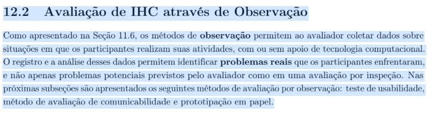
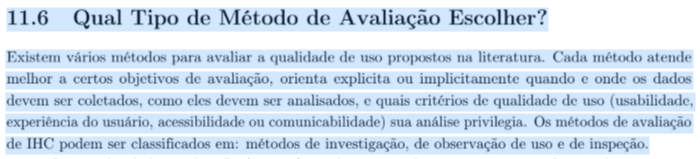

# Planejamento da Avaliação do Protótipo de Alta Fidelidade

## Colaboração
Colaboração referente a Etapa 6

| Autores | Contribuiu |
| :--- | :--- |
| Pedro Augusto Macedo Del Castilo | Elaborou o Artefato |

Este documento detalha o planejamento para a avaliação do protótipo de alta fidelidade elaborado para o projeto, utilizando o framework DECIDE proposto por Preece et al. (2002) e adaptado por Barbosa e Silva (2021)<a href="#ref1">[1]</a>. A avaliação tem como objetivo identificar problemas de usabilidade na interação, no design visual e na interface representados no protótipo de alta fidelidade diante da solução proposta para o sistema do PROCON-DF.

---

## Introdução
A avaliação do protótipo de alta fidelidade é uma etapa fundamental para validar os aspectos de design visual, navegabilidade e a clareza das interações antes do início do processo de codificação e desenvolvimento definitivo do sistema (*back-end*). Segundo Barbosa et al. (2021)<a href="#ref1">[1]</a>, a avaliação com usuários reais permite coletar percepções subjetivas e medir a qualidade de uso de uma solução de IHC de forma muito próxima à experiência real com o product final.

Este processo permite identificar pontos fracos na proposta de design, testar elementos de acessibilidade e mitigar a sobrecarga cognitiva dos usuários antes da etapa de implementação, garantindo que a solução final do PROCON-DF atenda com excelência e inclusão as necessidades de todo o público-alvo.

---

## Metodologia
Este planejamento de avaliação segue o framework DECIDE, uma abordagem sistemática proposta por Preece et al. (2002) e adaptada por Barbosa e Silva (2021)<a href="#ref1">[1]</a> para estruturar avaliações em Interação Humano-Computador (IHC).

O DECIDE funciona como um roteiro que orienta o avaliador através de seis etapas sequenciais, garantindo que todos os aspectos críticos sejam considerados. Cada letra representa uma fase do processo:

* **D** – Determinar os objetivos gerais da avaliação e identificar por que se está avaliando
* **E** – Explorar perguntas específicas que a avaliação deve responder
* **C** – Escolher os métodos de avaliação mais apropriados
* **I** – Identificar e administrar as questões práticas (recrutamento, cronograma, recursos)
* **D** – Decidir como lidar com questões éticas e de segurança dos participantes
* **E** – Avaliar (*Evaluate*) os dados coletados e relatar os resultados

### 1. D - Determinar os objetivos da avaliação <a href="#fig-d">[1]</a>
Com base nos tipos de avaliação descritos por Barbosa et al. (2021, Capítulo 11), esta avaliação está orientada a dois aspectos complementares: verificar a conformidade com um padrão e identificar problemas na interação e na interface representados no protótipo de alta fidelidade proposto para o sistema do PROCON-DF.

#### Verificar a Conformidade com um Padrão
A avaliação buscará identificar se o protótipo de alta fidelidade proposto está em conformidade com padrões de usabilidade e diretrizes de interface estabelecidas para o contexto do PROCON-DF (Barbosa et al., 2021, p. 249).

Objetivos específicos para este aspecto:

- Verificar se a organização visual, tipografia, contraste e a arquitetura de informação do protótipo interativo seguem padrões de usabilidade reconhecidos.

- Avaliar se o comportamento dos componentes interativos (botões, menus, mensagens) mantém consistência e previsibilidade para o usuário.

#### Identificar Problemas na Interação e na Interface
A avaliação de problemas na interação e na interface busca identificar, nos fluxos interativos simulados com o protótipo de alta fidelidade, elementos que possam prejudicar a qualidade de uso do sistema proposto (Barbosa et al., 2021, p. 249). Os problemas identificados serão classificados de acordo com sua gravidade e com os fatores de qualidade de uso prejudicados — usabilidade, experiência do usuário, acessibilidade ou comunicabilidade.

Objetivos específicos para este aspecto:

- Identificar obstáculos visuais, erros de percurso e dificuldades encontradas pelo usuário ao interagir com o dispositivo mobile ou desktop.

- Verificar se os fluxos de navegação propostos permitem que o usuário realize tarefas de ponta a ponta com eficiência e sem ambiguidade.

- Avaliar se a redação dos textos e orientações em linguagem cidadã é compreendida perfeitamente pelo usuário.

- Classificar os problemas encontrados quanto à gravidade potencial caso fossem implementados no sistema final.

*Exemplo Prático:* Se um integrante do grupo apresenta um fluxo voltado para o preenchimento de dados ou triagem e outro foca na consulta de informações, a avaliação investigará em ambos a conformidade com padrões (ex.: os feedbacks visuais de sucesso ou erro ocorrem como esperado?) e os problemas de interação (ex.: o usuário consegue concluir a tarefa sem ajuda externa? O design visual gerou alguma confusão sobre o que é clicável?).

### 2. E - Explorar perguntas a serem respondidas <a href="#fig-e">[2]</a>
Para tornar os objetivos operacionais, a equipe elaborou perguntas específicas organizadas pelos aspectos avaliados (Barbosa et al., 2021, p. 249-250).

#### Perguntas sobre Conformidade com Padrões
Com base em Barbosa et al. (2021, p. 250-251), as seguintes perguntas nortearão a avaliação deste aspecto:

1. Com o protótipo de alta fidelidade foi possível validar os conceitos visuais e o comportamento das interações planejadas?

2. Foi observada alguma sugestão de melhoria ou refinamento para o layout e componentes propostos?

3. A interface interativa está em conformidade com padrões de usabilidade e acessibilidade reconhecidos (ex.: contraste adequado, hierarquia visual clara, feedback imediato de ação)?

#### Perguntas sobre Problemas na Interação e na Interface
Com base em Barbosa et al. (2021, p. 250-251), as seguintes perguntas nortearão a avaliação deste aspecto:

1. Foi possível identificar problemas de usabilidade ou gargalos nos fluxos interativos?

2. O usuário consegue operar o sistema representado no protótipo de alta fidelidade? Ele atinge seu objetivo de forma autônoma? Com quanta eficiência? Após cometer quantos erros ou hesitações?

3. Que parte da interface, do design visual ou do fluxo de telas o deixa insatisfeito, inseguro ou confuso?

4. O usuário entende o significado e a função de cada elemento interativo e instrução textual presente na tela? Ele sabe como prosseguir para a próxima etapa?

5. Quais barreiras cognitivas ou operacionais o usuário encontra para atingir seus objetivos nas tarefas propostas?

### 3. C - Escolher (Choose) os métodos de avaliação <a href="#fig-c">[3]</a>
Como o protótipo de alta fidelidade oferece uma simulação interativa com alto grau de realismo visual e comportamental, os métodos baseados em testes diretos e observação ativa são perfeitamente aplicáveis.

**Métodos empregados:** **Teste de Usabilidade** (método de observação<a href="#fig-cap122">[7]</a>), conduzido com protocolo Think Aloud e observação direta durante a execução das tarefas com o Protótipo de Alta Fidelidade, complementado por **Entrevista Semiestruturada** pós-sessão (método de investigação<a href="#fig-cap116">[8]</a>). A combinação segue a recomendação de Barbosa et al. (2021, Cap. 11.6) de integrar a investigação à observação para obter dados mais robustos; o Teste de Usabilidade pertence à família dos métodos de observação (Barbosa et al., 2021, Cap. 12.2), e a Entrevista Semiestruturada à família dos métodos de investigação (Cap. 11.6).

**Justificativa:** O método de observação direta em conjunto com o protocolo *Think Aloud* permite que o avaliador capte o comportamento, as expressões faciais e as linhas de raciocínio do participante em tempo real enquanto ele opera o protótipo no dispositivo. Complementarmente, a entrevista semiestruturada após as tarefas possibilita coletar de forma flexível as impressões subjetivas do usuário sobre a estética e a clareza da interface. O formato semiestruturado dá liberdade ao avaliador para realizar perguntas de acompanhamento (*follow-up*) contextualizadas a partir de falhas ou hesitações específicas manifestadas pelo participante ao longo do teste. Toda a sessão deve ser estritamente gravada e documentada.

### 4. I - Identificar e administrar as questões práticas <a href="#fig-i">[4]</a>
Para garantir a viabilidade e o rigor metodológico da avaliação do protótipo de alta fidelidade do PROCON-DF, a equipe deverá gerenciar os seguintes aspectos organizacionais:

- **Recrutamento de Participantes:** Cada integrante do grupo será responsável por recrutar participantes que se encaixem no perfil de usuário definido no projeto. Os participantes devem apresentar semelhança com as personas estabelecidas — em especial Laura (Consumidora Reclamante) e Gustavo (Fornecedor/Comerciante).
- **Preparação da Avaliação:** Cada sessão será conduzida individualmente por um integrante do grupo, que atuará como moderador e anotador — responsável por disponibilizar o protótipo rodando no dispositivo, guiar o participante ao longo dos cenários, registrar comportamentos e gerenciar a gravação. A avaliação ocorrerá de forma presencial, em ambiente silencioso e controlado.
- **Tarefas Avaliadas:** Para manter o caráter abrangente do documento, os testes cobrirão as grandes jornadas macro da solução do PROCON-DF, permitindo que cada avaliador foque ou adapte as instruções para a funcionalidade sob sua responsabilidade:

  1. Registrar uma reclamação ou denúncia no PROCON-DF.

  2. Consultar o andamento ou histórico de um processo/atendimento.

  3. Buscar e ler informações pedagógicas relacionadas aos direitos do consumidor.

  4. Localizar e acessar serviços gerais disponibilizados na interface do sistema.

- **Materiais Necessários:** Dispositivo eletrônico (smartphone ou computador) com o link do protótipo interativo de alta fidelidade ativo, Termo de Consentimento Livre e Esclarecido (TCLE) impresso ou digital, roteiro semiestruturado de perguntas, formulário de anotações do observador e um segundo aparelho celular configurado para capturar o áudio, vídeo e a tela do teste.
- **Recursos e Custos:** A avaliação foi planejada para ter custo zero, fazendo uso dos aparelhos eletrônicos dos próprios estudantes para a simulação e gravação das rodadas.
- **Cronograma:** As rodadas de testes serão agendadas conforme a disponibilidade dos participantes e prazos internos da disciplina. Os resultados individuais devem ser documentados logo após o término da sessão.

| Sessão | Integrante | Participante | Horário de Início | Horário de Fim | Data |
| :---: | :--- | :---: | :---: | :---: | :---: |
| Sessão 1 | [Nome do Integrante] | [ID do Participante] | [Hora] | [Hora] | [Data] |
| Sessão 2 | [Nome do Integrante] | [ID do Participante] | [Hora] | [Hora] | [Data] |
| Sessão 3 | [Nome do Integrante] | [ID do Participante] | [Hora] | [Hora] | [Data] |
| Sessão 4 | [Nome do Integrante] | [ID do Participante] | [Hora] | [Hora] | [Data] |
| Sessão 5 | [Nome do Integrante] | [ID do Participante] | [Hora] | [Hora] | [Data] |

#### Roteiro de Perguntas (Abordagem Semiestruturada)
O roteiro foi construído sob a ótica de uma entrevista semiestruturada, mesclando perguntas abertas e tópicos norteadores dispostos em ordem lógica, permitindo flexibilidade para explorar as reações dos participantes em profundidade.

*Perguntas de Exemplo para o Protótipo de Alta Fidelidade:*
- **Opinião Geral:** O que você achou da aparência e da organização visual das telas apresentadas? Elas transmitem clareza e credibilidade para o contexto do PROCON-DF?

- **Navegabilidade:** Você saberia identificar como avançar para a próxima etapa ou retornar se necessário? Sentiu-se perdido em algum momento do fluxo?

- **Clareza dos Elementos:** Algum componente de interface (como botões, ícones, menus ou campos de preenchimento) ou mensagem textual gerou confusão, dúvida ou erro?

- **Completude do Fluxo:** Na sua percepção como cidadão, as informações e confirmações exibidas na tela foram suficientes para você ter certeza de que a tarefa foi concluída com sucesso?

#### Execução do Roteiro
A sessão de avaliação seguirá uma estrutura narrativa linear visando o conforto do participante e a qualidade da extração de dados:

1. **Apresentação:** O avaliador se apresenta, contextualiza os objetivos acadêmicos da avaliação do sistema do PROCON-DF e garante o absoluto sigilo e tratamento dos dados.

2. **Aquecimento:** Perguntas simples de introdução (dados demográficos e rotina de uso de tecnologias e smartphones) para estabelecer um clima de tranquilidade.

3. **Simulação com o Protótipo (Parte Principal):** O avaliador insere o participante no cenário de uso e solicita a execução das tarefas. O usuário deve ser estimulado a pensar em voz alta enquanto navega no protótipo de alta fidelidade. O avaliador observa atentamente e faz intervenções sutis de *follow-up* (ex: "O que você esperava que acontecesse ao clicar ali?") ao notar hesitações ou comportamentos atípicos.

4. **Desaquecimento:** Espaço livre para o usuário compartilhar percepções gerais espontâneas e relaxar após as tarefas.

5. **Encerramento:** O avaliador agradece formally a contribuição e indica os canais de contato da equipe.

*Atenção na Condução:* O entrevistador deve manter total neutralidade, abstendo-se de formular perguntas que induzam respostas positivas sobre o design desenvolvido. Em vez de perguntar "Esta barra de progresso ajudou você?", deve-se perguntar "O que você achou daquela sinalização no topo da tela?". Toda e qualquer barreira de usabilidade identificada deve ser anotada sem julgamentos.

### 5. D - Decidir como lidar com as questões éticas <a href="#fig-d2">[5]</a>
A avaliação envolve a participação ativa de seres humanos, logo, os princípios éticos universais de pesquisa científica devem ser plenamente respeitados para garantir a proteção de dados e a integridade dos usuários.

- **Termo de Consentimento (TCLE):** O avaliador disponibilizará o TCLE e colherá o consentimento formal (assinado por escrito ou registrado em vídeo) antes de dar início ao teste. O documento explicará a natureza acadêmica do projeto, os objetivos do teste e o tempo estimado de duração.
- **Direito de Retirada:** Ficará esclarecido de maneira transparente ao participante que ele possui total liberdade para interromper ou desistir do teste a qualquer momento, sem a necessidade de dar explicações e sem sofrer sanções de qualquer espécie.
- **Privacidade e Anonimato:** Nenhuma informação pessoal sensível ou nomes civis completos serão publicados nos relatórios públicos da disciplina. Os participantes serão referenciados unicamente por códigos identificadores (ex: "Participante 1 — P1"). Capturas de tela contendo feições faciais dos usuários serão borradas ou ocultadas por padrão, a não ser que haja uma autorização expressa no termo.
- **Foco no Artefato, Não no Indivíduo:** O avaliador deve tranquilizar o usuário no início da sessão através de um alinhamento padronizado: *"Nós estamos avaliando o nosso protótipo de alta fidelidade e as nossas escolhas de design, não estamos avaliando as suas capacidades. Não existem respostas certas ou erradas; a sua total sinceridade diante das dificuldades é o que nos ajuda a melhorar o sistema."*

### 6. E - Avaliar (Evaluate), interpretar e apresentar os dados <a href="#fig-e2">[6]</a>
O processo de avaliação não termina quando a sessão acaba. Para que o trabalho tenha validade, os dados coletados precisam ser tratados e consolidados da seguinte maneira:

- **Transcrição e Compilação Bruta:** O observador fará a revisão minuciosa das mídias gravadas para transcrever os relatos verbais pertinentes (*think aloud* e entrevista), extraindo falas de impacto, pontos críticos de falhas e sugestões dadas pelos participantes.

- **Análise e Categorização:** A equipe se reunirá para tabular os dados qualitativos coletados, distribuindo-os conforme os aspectos avaliados:

  - *Problemas na interação e na interface:* Agrupamento dos incidentes observados por tipo de barreira de IHC (falta de feedback, erro de navegação, layout confuso, texto incompreensível), mapeando o fator de qualidade de uso prejudicado e o grau de severidade potencial.

  - *Conformidade com padrões:* Compilação das conformidades ou inconformidades detectadas em relação às boas práticas de design e arquitetura de telas.

- **Identificação de Problemas e Sugestões:** A partir da convergência dos dados, o grupo consolidará a listagem definitiva de problemas de usabilidade encontrados nas interfaces de alta fidelidade.

- **Relato dos Resultados:** A equipe documentará e publicará os resultados no artefato de relato final contendo:

  - O contexto de execução e detalhamento do perfil demográfico dos usuários reais recrutados.

  - O *Feedback* Positivo destacando quais propostas de layout, navegação e escolhas estéticas foram validadas e bem recebidas pelos participantes.
  
  - A Tabela Comparativa de Problemas e Melhorias, contendo a descrição do problema, classificação de gravidade (leve, moderado ou grave), fator de qualidade de uso afetado (usabilidade, experiência do usuário, comunicabilidade ou acessibilidade), a justificativa empírica embasada nas reações/falas do usuário e a respectiva proposta de correção em nível de design que será implementada na versão final.

---

## 7. Teste Piloto
Antes de iniciar as sessões de teste com o público externo, a equipe conduzirá um teste piloto controlado com um colega de projeto ou estudante da área. O propósito do piloto é validar a consistência e o planejamento da sessão: verificar se o tempo total condiz com a estimativa de 20 a 30 minutos, atestar se o link interativo do protótipo de alta fidelidade funciona corretamente e checar a qualidade e o posicionamento do equipamento de gravação e captação de tela.

Embora os dados e opiniões coletados durante o piloto devam ser integralmente descartados da análise qualitativa final dos resultados, a sua ocorrência deverá ser devidamente registrada. No relato final, os avaliadores registrarão a data, o horário, a duração e, primordialmente, os ajustes ou refinamentos que foram necessários realizar no roteiro semiestruturado ou no protótipo após o encerramento do teste piloto e antes das entrevistas oficiais.

---

## Agradecimentos à IA
Agradecimento ao Gemini pela ajuda na estruturação e alinhamento deste documento ao montar o padrão de seções e formatação de texto de acordo com o modelo fornecido.

---

## Referências

[1] BARBOSA, Simone D. J.; SILVA, Bruno S. da; SILVEIRA, Milene S.; GASPARINI, Isabela; DARIN, Ticianne; BARBOSA, Gabriel D. J. **Interação Humano-Computador e Experiência do Usuário**. 1. ed. Rio de Janeiro: Autopublicação, 2021.

---

## Histórico de Versão

| Versão | Data | Descrição | Autor | Revisor |
| :---: | :---: | :--- | :--- | :--- |
| 1.0 | 07/06/2026 | Criação do planejamento da avaliação do protótipo de alta fidelidade com base no framework DECIDE. | Pedro Augusto Macedo Del Castilo | Heitor Macedo |

---

## Notas de Rodapé e Referências de Imagens

**Figura 1** - D: Determinar os objetivos da avaliação.

Fonte: BARBOSA et al. (2021, p. 264).<a href="#ref1">[1]</a>

**Figura 2** - E: Explorar perguntas a serem respondidas.

Fonte: BARBOSA et al. (2021, p. 264).<a href="#ref1">[1]</a>

**Figura 3** - C: Escolher os métodos de avaliação.

Fonte: BARBOSA et al. (2021, p. 264).<a href="#ref1">[1]</a>

**Figura 4** - I: Identificar e administrar as questões práticas.

Fonte: BARBOSA et al. (2021, p. 264).<a href="#ref1">[1]</a>

**Figura 5** - D: Decidir como lidar com as questões éticas.

Fonte: BARBOSA et al. (2021, p. 264).<a href="#ref1">[1]</a>

**Figura 6** - E: Avaliar (Evaluate), interpretar e apresentar os dados.

Fonte: BARBOSA et al. (2021, p. 264).<a href="#ref1">[1]</a>

**Figura 7** - Cap. 12.2 — O Teste de Usabilidade como método de observação (Barbosa et al., 2021).

Fonte: BARBOSA et al. (2021, Cap. 12.2).

**Figura 8** - Cap. 11.6 — Classificação dos métodos de avaliação em investigação, observação e inspeção (Barbosa et al., 2021).

Fonte: BARBOSA et al. (2021, Cap. 11.6).