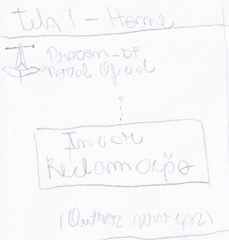
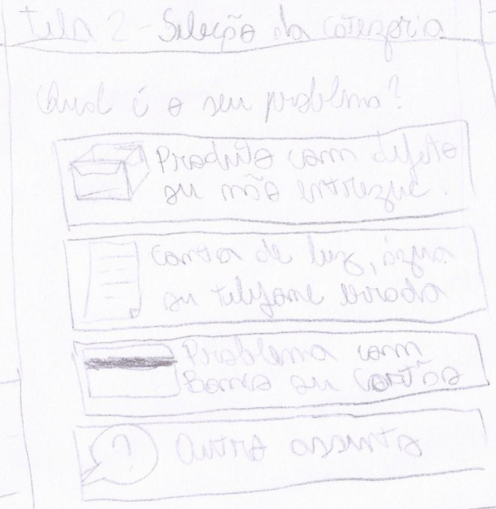
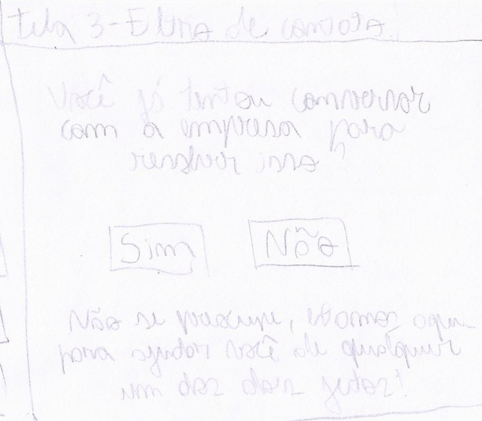
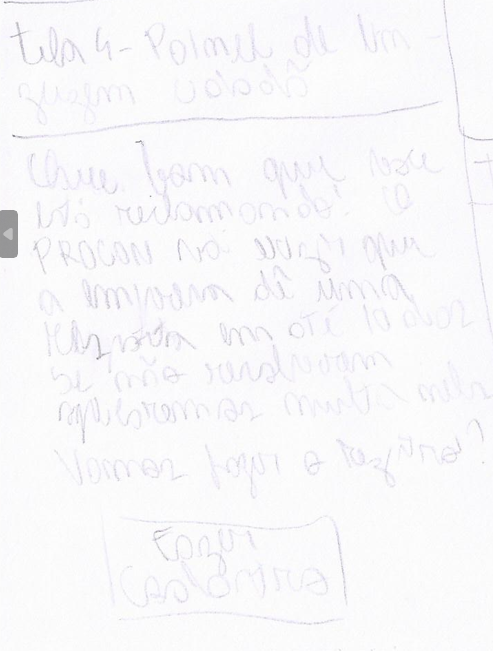
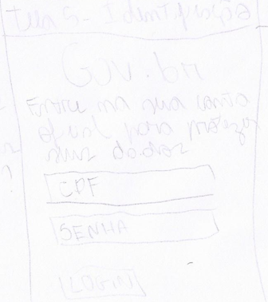
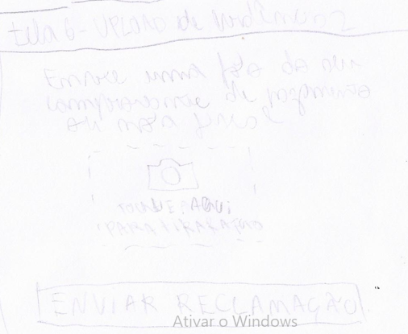
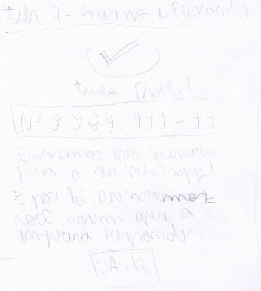

# Protótipo de Papel — Assistente de Triagem Guiada para Reclamações

## Colaboração

Colaboração referente a [Etapa 5](../planejamento/cronograma-executado.md)

| Autores | Contribuiu |
|---|---|
| Pedro Macedo | Elaborou o Artefato |

## Introdução

O protótipo de papel é um método de prototipação de baixa fidelidade que permite explorar ideias de design de forma rápida e econômica, sem a necessidade de implementação complexa. Segundo Barbosa et al. (2021), o método consiste em simular a interface com o usuário por meio de esboços em papel (ou equivalentes digitais de baixa fidelidade), possibilitando identificar problemas de usabilidade e comparar alternativas de design antes do investimento em soluções de maior fidelidade.

Este artefato apresenta o protótipo de papel desenvolvido para a funcionalidade do Assistente de Triagem Guiada para Reclamações do sistema PROCON-DF. A funcionalidade visa eliminar a barreira de entrada cognitiva e a sobrecarga de informações da página inicial atual, substituindo-a por um fluxo interativo e amigável de perguntas e respostas (mecanismo *wizard*) estruturado em linguagem cidadã. Como fundamentado na literatura clássica de IHC contida em "Design de interação - StoryBoard.pdf", o uso de protótipos de baixa fidelidade é ideal para validar conceitos primitivos de fluxo diretamente com o usuário final de maneira ágil. O protótipo foi elaborado com base na análise de tarefas, nos cenários de uso e na persona primária Ivone Maria da Silva — auxiliar de limpeza de 56 anos, usuária de smartphone com baixa tolerância à complexidade visual e medo de cair em páginas fraudulentas ou e-mails de spam.

## Fluxo Representado

O protótipo cobre as seguintes telas e interações focadas na jornada mobile da usuária:

- **Tela 1:** Home do PROCON-DF Limpa — Foco total no grande botão central de alto contraste para iniciar a queixa.
- **Tela 2:** Seleção de Categoria — Cards e ícones grandes que facilitam a classificação do problema por reconhecimento.
- **Tela 3:** Filtro de Contato Prévio — Pergunta direta com botões simples de "Sim" ou "Não" sobre tentativas com a empresa.
- **Tela 4:** Painel de Linguagem Cidadã — Explicação clara do papel do PROCON em tom acolhedor e pedagógico.
- **Tela 5:** Identificação Integrada — Tela de transição e autenticação segura via Gov.br simplificado.
- **Tela 6:** Upload Guiado de Evidências — Área otimizada para capturar fotos de comprovantes diretamente pela câmera do celular.
- **Tela 7:** Tela de Sucesso e Protocolo — Exibição do número de protocolo em destaque e confirmação de envio de alertas via WhatsApp.

## Protótipo de Papel (Modelos de Telas)

Abaixo estão dispostos os espaços reservados para a inclusão dos esboços de papel correspondentes a cada tela do fluxo, estruturados em conformidade com as normas ABNT para apresentação de ilustrações.

### Figura 1 – Tela 1: Home do PROCON-DF com foco em Clean Design

**Fonte:** Elaborado pelo autore (2026).

### Figura 2 – Tela 2: Seleção de categoria por cards ilustrados

**Fonte:** Elaborado pelo autor (2026).

### Figura 3 – Tela 3: Filtro de contato amigável

**Fonte:** Elaborado pelo autor (2026).

### Figura 4 – Tela 4: Painel pedagógico em linguagem cidadã

**Fonte:** Elaborado pelo autor (2026).

### Figura 5 – Tela 5: Identificação simplificada via Gov.br

**Fonte:** Elaborado pelo autor (2026).

### Figura 6 – Tela 6: Área de upload guiado por câmera

**Fonte:** Elaborado pelo autor (2026).

### Figura 7 – Tela 7: Confirmação de protocolo e satisfação

**Fonte:** Elaborado pelo autor (2026).

## Decisões de Design

As principais escolhas de design refletidas no protótipo são:

- **Botão centralizado de alto contraste (CTA)** — Foca a ação principal logo na entrada do sistema, atendendo diretamente à expectativa de simplicidade apontada no grupo de foco.
- **Interface minimalista (Clean Design)** — Redução drástica de banners informativos, notícias paralelas e poluição visual, mitigando o receio de links falsos ou páginas de "spam".
- **Design para reconhecimento** — Uso de cards grandes e ícones cotidianos na seleção de categorias, evitando a necessidade de digitação textual exaustiva em dispositivos móveis.
- **Linguagem cidadã e pedagógica** — Substituição de jargões do Código de Defesa do Consumidor (CDC) por textos diretos, amigáveis e explicativos sobre os prazos e deveres do órgão.
- **Captura direta via hardware (Mobile-First)** — Otimização do upload de documentos através do acionamento nativo da câmera do smartphone, contornando a dificuldade de gerenciamento de arquivos PDF locais.

## Referência

BARBOSA, S. D. J.; SILVA, B. S.; SILVEIRA, M. S.; GASPARINI, I.; DARIN, T.; BARBOSA, G. D. J. **Interação Humano-Computador e Experiência do usuário**. Autopublicação, 2021.

## Agradecimentos

Este artefato contou com o apoio do assistente de IA Gemini, que colaborou nas seguintes frentes:

| Contribuição | Descrição |
|--------------|-----------|
| Estrutura e formatação do artefato | Adaptação e organização do modelo padrão para a nova funcionalidade de Triagem Guiada, mantendo o rigor metodológico. |
| Modelagem de fluxo para acessibilidade | Apoio no detalhamento conceitual das telas visando mitigar barreiras cognitivas da persona de baixa literacia digital. |
| Alinhamento com Normas Técnicas | Estruturação de placeholders e metadados de figuras seguindo as diretrizes de formatação da ABNT. |

## Histórico de Versão

| Versão | Data | Descrição | Autor(es) | Revisor(es) |
|--------|------|-----------|-----------|-------------|
| 1.0 | 04/06/2026 | Adaptação para Triagem Guiada e detalhamento do fluxo da persona Ivone. | Pedro Augusto Macedo Del Castilo | Heitor Macedo |