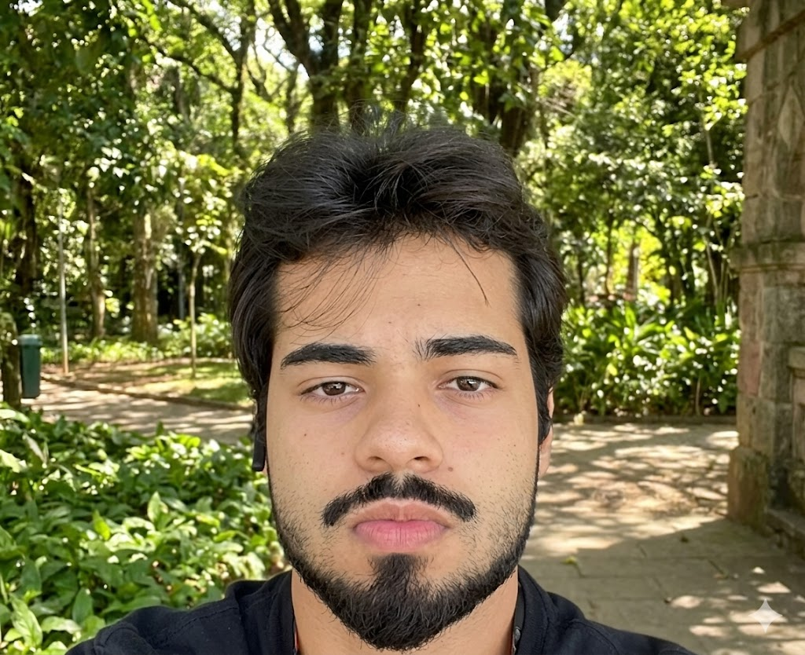

# A Equipe

Conheça os membros responsáveis por este projeto da disciplina de Interação Humano-Computador.

---

-   

    

    **Heitor Macêdo Ricardo**

    *Mini-bio a ser preenchida...*

    [🐙 GitHub](#) • [💼 LinkedIn](#)
    

-   

    

    **[Nome do Participante 2]**

    *Mini-bio a ser preenchida...*

    [🐙 GitHub](#) • [💼 LinkedIn](#)
    

-   

    

    **[Nome do Participante 3]**

    *Mini-bio a ser preenchida...*

    [🐙 GitHub](#) • [💼 LinkedIn](#)
    

-   

    

    **[Nome do Participante 4]**

    *Mini-bio a ser preenchida...*

    [🐙 GitHub](#) • [💼 LinkedIn](#)
    

-   

    

    **[Nome do Participante 5]**

    *Mini-bio a ser preenchida...*

    [🐙 GitHub](#) • [💼 LinkedIn](#)
    

-   

    

    **[Nome do Participante 6]**

    *Mini-bio a ser preenchida...*

    [🐙 GitHub](#) • [💼 LinkedIn](#)
    

