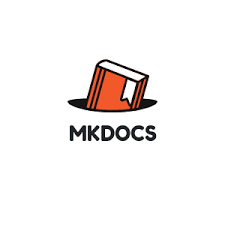

## Ferramentas Utilizadas

A seguir estão as principais ferramentas empregadas ao longo do desenvolvimento do projeto:

---

### GitHub

  

**Finalidade:**  
Utilizado para versionamento de código, armazenamento do repositório e colaboração entre os membros da equipe.

---

### MkDocs

  

**Finalidade:**  
Geração de site estático para documentação do projeto.

---

### Figma / Penpot

  
  

**Finalidade:**  
Criação de protótipos, wireframes e design de interface.

---

### Teams / Discord / WhatsApp

  
  
  

**Finalidade:**  
Comunicação e alinhamento entre os membros da equipe.

---

## Referências

GITHUB. Plataforma de hospedagem de código-fonte e controle de versão. Disponível em: <https://github.com/>. Acesso em: 12 abr. 2026.

MKDOCS. Gerador de sites estáticos para documentação. Disponível em: <https://www.mkdocs.org/>. Acesso em: 12 abr. 2026.

FIGMA. Ferramenta de design de interface colaborativo. Disponível em: <https://www.figma.com/>. Acesso em: 12 abr. 2026.

PENPOT. Plataforma open source para design e prototipação. Disponível em: <https://penpot.app/>. Acesso em: 12 abr. 2026.

MICROSOFT TEAMS. Plataforma de comunicação e colaboração. Disponível em: <https://www.microsoft.com/teams>. Acesso em: 12 abr. 2026.

DISCORD. Plataforma de comunicação por voz, vídeo e texto. Disponível em: <https://discord.com/>. Acesso em: 12 abr. 2026.

WHATSAPP. Aplicativo de mensagens instantâneas. Disponível em: <https://www.whatsapp.com/>. Acesso em: 12 abr. 2026.