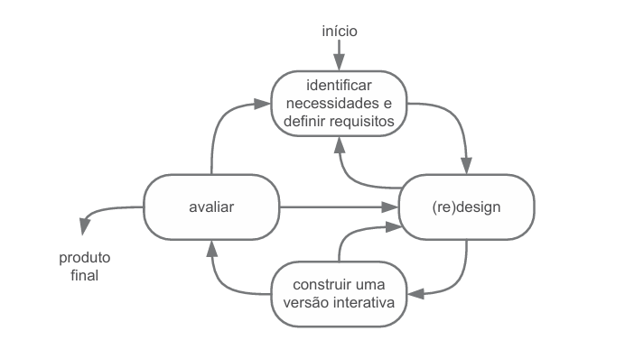
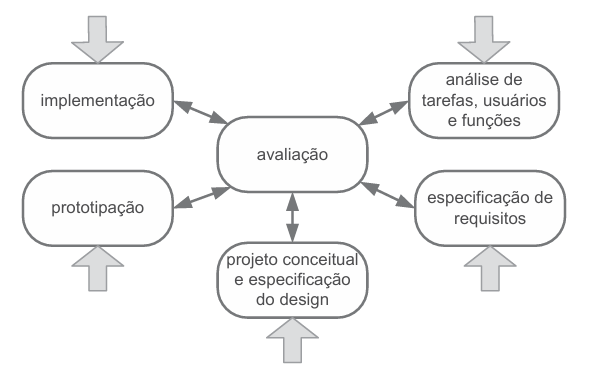
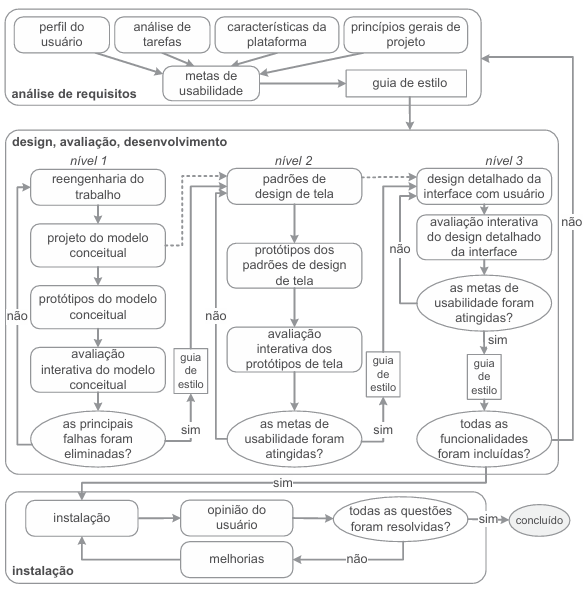

# Processo de Design

Para compreender o que é um Processo de Design, primeiro é necessário entender o próprio conceito de design. Segundo Barbosa e Silva (2021), o design pode ser organizado em três atividades básicas: análise da situação atual, síntese de uma intervenção e avaliação dessa intervenção.

A **análise da situação atual**, conforme Barbosa e Silva (2021), envolve a compreensão dos elementos presentes no contexto investigado, permitindo interpretar com mais precisão a realidade observada. Em outras palavras, após essa etapa, obtém-se uma visão mais clara das necessidades e oportunidades de melhoria que precisam ser endereçadas.

Já a **síntese de intervenção** corresponde à definição da situação desejada e à elaboração de uma **intervenção** capaz de conduzir a transição entre o estado atual e o estado pretendido.

A **avaliação**, por sua vez, pode ocorrer em diferentes momentos do processo e tem como objetivo verificar se a intervenção proposta está, de fato, transformando a situação atual na direção esperada.

Com base nessas definições, entende-se o Processo de Design como o detalhamento dessas atividades básicas, abrangendo desde a forma de execução de cada etapa até os artefatos produzidos e consumidos ao longo do processo (BARBOSA; SILVA, 2021).

Alguns dos modelos de Processo de Design estudados em sala de aula são citados abaixo:

## Ciclo de Vida Simples

{: style="display: block; margin: 0 auto;" }

  <b>Figura 01 - Representação Gráfica do Modelo Simples</b> 
  <b>Fonte: (BARBOSA; SILVA, 2021).</b>

Desenvolvido por Sharp, Preece e Rogers, este é um processo de design centrado no usuário, com uso do desenvolvimento de versões interativas da proposta de solução e da iteração entre atividades, nesse processo as atividades não seguem uma ordem específica, podendo-se retornar para qualquer atividade do processo conforme a necessidade e a iteração entre elas pode ocorrer quantas vezes forem necessárias (BARBOSA; SILVA, 2021).

## Ciclo de Vida em Estrela

{: style="display: block; margin: 0 auto;" }

  <b>Figura 02 - Representação Gráfica do Modelo em Estrela</b> 
  <b>Fonte: (BARBOSA; SILVA, 2021).</b>

Desenvolvido por Hix e Hartson, esse processo possui seis atividades, sendo a avaliação a atividade central. A ordem da execução das atividades é de discrição do designer de acordo com a sua intenção (BARBOSA; SILVA, 2021).

Segundo Barbosa e Silva (2021), esse modelo a atividade de síntese é segmentada nas atividades de projeto conceitual e **especificação do design**, **prototipação** e **implementação**.

## Ciclo de Vida Mayhew

{: style="display: block; margin: 0 auto;" }

  <b>Figura 03 - Representação Gráfica do Modelo Mayhew</b> 
  <b>Fonte: (BARBOSA; SILVA, 2021).</b>

Segundo Barbosa e Silva (2021), o ciclo de vida de Mayhew organiza atividades clássicas de IHC em um processo iterativo com três fases: análise de requisitos; design, avaliação e desenvolvimento; e instalação. Essas fases podem ser descritas da seguinte forma:

 - **Análise de Requisitos:** Nesta etapa, definem-se metas de usabilidade com base no perfil dos usuários, na análise de tarefas, em princípios gerais de design de IHC e nas limitações da plataforma (BARBOSA; SILVA, 2021).

 - **Design, avaliação e desenvolvimento:** Nessa fase, a solução de IHC é elaborada em três níveis (BARBOSA; SILVA, 2021):
   - No primeiro nível, são produzidos e avaliados protótipos de baixa fidelidade.
   - No segundo, são definidos padrões de design e desenvolvidos protótipos de média fidelidade.
   - No terceiro, é elaborado o projeto com interface detalhada e de alta fidelidade.
 - **Instalação:** Após o uso, são coletadas opiniões dos usuários para consolidar melhorias no sistema (BARBOSA; SILVA, 2021).

## Processo de Design Selecionado: Engenharia de Usabilidade de Nielsen

Para guiar o desenvolvimento do nosso projeto, selecionamos o ciclo de vida da **Engenharia de Usabilidade de Jakob Nielsen**. 

> **[PENDENTE]** Inserir foto/imagem do livro referente ao Processo de Design Selecionado. (Para ser preenchido pelos demais membros).

## Justificativa da Escolha:
Optamos por este processo porque ele propõe um conjunto de atividades que ocorrem durante todo o ciclo de vida do produto, com uma forte ênfase na avaliação contínua e no design iterativo. Isso nos permite identificar e corrigir problemas de usabilidade desde os estágios iniciais, garantindo que o sistema final atenda às reais necessidades dos usuários antes de focar apenas na implementação técnica.

> **[PENDENTE]** Inserir foto/imagem do livro referente à Justificativa. (Para ser preenchido pelos demais membros).

## Como aplicaremos o processo no nosso projeto:
Nielsen propõe 10 atividades básicas. Para a execução do nosso projeto, organizamos essas atividades nas seguintes fases práticas:

**1. Fase de Descoberta e Planejamento**
*   **Conhecer o usuário:** Vamos levantar dados para criar perfis de usuários e personas, focando em suas características, ambiente e objetivos finais com o sistema.
*   **Análise competitiva:** Examinaremos sistemas semelhantes ou concorrentes para extrair boas ideias e identificar falhas que não devemos repetir.
*   **Definição das metas de usabilidade:** Estabeleceremos quais fatores de qualidade (eficiência, satisfação, facilidade de aprendizado) serão prioridade no nosso design.

**2. Fase de Concepção e Design**
*   **Designs paralelos e Design participativo:** Membros da equipe criarão alternativas iniciais de design de forma independente. Em seguida, selecionaremos as melhores ideias, mantendo o foco em ouvir o feedback de usuários representativos sempre que possível.
*   **Design coordenado da interface:** Padronizaremos a identidade visual, a linguagem e o tom do sistema para garantir consistência.
*   **Prototipação:** Desenvolveremos protótipos rápidos e de baixo custo (como protótipos de papel ou *wireframes*) para materializar nossas ideias antes de escrever qualquer código.

**3. Fase de Avaliação e Refinamento**
*   **Diretrizes e Análise Heurística:** A equipe aplicará as 10 Heurísticas de Nielsen sobre os protótipos para encontrar potenciais violações de usabilidade (Método de Inspeção).
*   **Testes empíricos:** Realizaremos sessões de observação com usuários reais interagindo com nossos protótipos para identificar onde eles realmente encontram barreiras.
*   **Design iterativo:** Com base nos problemas encontrados nas inspeções e testes, faremos as correções necessárias na interface e repetiremos o ciclo de avaliação até atingirmos nossas metas de usabilidade.

> **[PENDENTE]** Inserir foto/imagem do livro referente à aplicação do processo. (Para ser preenchido pelos demais membros).

 

{: style="display: block; margin: 0 auto;" }

  <b>Figura 1 - Processo de Design</b> 
  Fonte: Heitor Macedo

---

## Referências Bibliográficas

> 1. BARBOSA, Simone Diniz Junqueira; SILVA, Bruno Santana da. *Interação Humano-Computador*. Rio de Janeiro: Elsevier, 2021.

---

## Agradecimentos à Inteligência Artificial

Agradecimento especial ao **NotebookLM** pelo auxílio na criação da imagem de processo de design que foi utilizada.

---

## Histórico de Versão

| Versão | Data       | Descrição                                                                                                                                                                                                                                              | Autor                 | Revisor |
| ------ | ---------- | ------------------------------------------------------------------------------------------------------------------------------------------------------------------------------------------------------------------------------------------------------ | --------------------- | ------- |
| 1.1    | 11/04/2026 | Revisão da redação introdutória do Processo de Design e inserção das representações gráficas dos modelos Ciclo de Vida Simples, Ciclo de Vida em Estrela e Ciclo de Vida Mayhew, com legendas padronizadas.                                           | Heloisa Silva         |         |
| 1.0    | 11/04/2026 | Inclusão do embasamento textual em Nielsen, justificativas, mapeamento de fases do projeto, inserção da imagem do processo e marcação dos espaços faltantes (fotos do livro e referências) para inclusão futura pelos demais integrantes da equipe. | Heitor Macedo RIcardo |     Heloisa Silva    |
